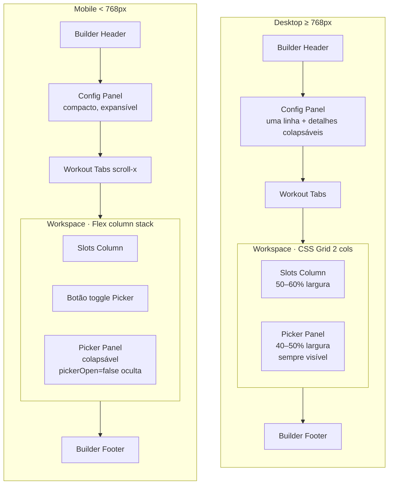

# Design Document — Builder Screen UI Redesign

## Overview

A Builder Screen (`#builder-screen`) atual concentra muitas seções verticais e abre o banco de exercícios como modal sobreposto, fragmentando o fluxo de montagem do programa. Este redesign reorganiza a tela em um workspace contínuo inspirado no fluxo "Monte Seu PC" da KaBuM!: configuração compactada em um único painel, abas de treino mais leves e o banco de exercícios integrado inline em uma segunda coluna no desktop (ou seção empilhada no mobile), substituindo o modal `#exercise-picker-modal`.

O escopo é exclusivamente de UI/UX e de organização do estado de renderização. A persistência (`persistCustomProgramFromBuilder`, `TRAINING_PROGRAMS`, `localStorage`) e o modal de Exercise Form (`#exercise-edit-modal`) permanecem inalterados. O `BUILDER_STATE` é estendido de forma aditiva, sem renomear ou remover campos existentes, para preservar compatibilidade com o restante do app.

Decisões-chave do redesign:

- **Painel de configuração único**: nome, semanas e agenda agrupados em um único bloco com resumo inline e detalhamento colapsável no desktop.
- **Picker inline orientado por estado**: `BUILDER_STATE.pickerOpen` controla a visibilidade. No desktop, o picker fica visível por padrão quando o workspace é renderizado; no mobile, há um botão de toggle.
- **Adição rápida sem modal intermediário**: clicar em um Picker Item adiciona o exercício imediatamente com defaults sensatos (3 séries, "8 a 12" reps, "60 seg" descanso, método "Convencional"). O Exercise Form abre apenas via "Editar" no slot ou via "Custom Exercise Action".
- **Indicador "já adicionado"**: cada Picker Item reflete dinamicamente se o exercício correspondente está no Active Workout.
- **Render funcional decomposto**: `renderBuilder` é dividido em renderizadores por painel para que cada mutação de `BUILDER_STATE` cause o menor re-render possível.

## Architecture

### Mapa estrutural da tela

```
#builder-screen
├── .builder-header                                  (existente, refinado)
├── .builder-content                                 (container rolável)
│   ├── .builder-config-panel        ← novo, agrupa nome + semanas + agenda
│   │   ├── .builder-config-summary  ← linha resumo (desktop colapsado)
│   │   └── .builder-config-details  ← campos completos (expansível)
│   ├── .builder-workout-tabs        (refinado, mais leve)
│   ├── .builder-workspace           ← novo container 2 colunas (desktop) / stack (mobile)
│   │   ├── .builder-slots-column
│   │   │   ├── .builder-workout-meta   ← contagens inline (substitui #builder-summary)
│   │   │   └── #builder-slots-list
│   │   └── .builder-picker-panel    ← inline, substitui #exercise-picker-modal
│   │       ├── .builder-picker-header (search + close/toggle)
│   │       ├── .builder-picker-filters
│   │       └── .builder-picker-list (com indicador "já adicionado")
│   └── .builder-mobile-picker-toggle ← visível apenas em < 768px
└── .builder-footer                                  (existente)
```

O elemento `#exercise-picker-modal` é removido do DOM. Seu conteúdo interno (search, filtros, lista, custom card) é portado para `.builder-picker-panel` mantendo IDs onde possível para preservar referências internas (por exemplo `#exercise-picker-search`, `#exercise-picker-filters`, `#exercise-picker-list`). O `#exercise-edit-modal` é mantido sem alterações.

### Layout responsivo



- **Desktop (`min-width: 768px`)**: `.builder-workspace` usa `display: grid; grid-template-columns: minmax(0, 1.2fr) minmax(0, 1fr); gap: 24px;` garantindo que slots ocupem entre 50% e 60% do espaço útil (R7.4).
- **Mobile (`max-width: 767.98px`)**: `.builder-workspace` usa `display: flex; flex-direction: column; gap: 16px;`. O picker é renderizado como seção empilhada controlada por `BUILDER_STATE.pickerOpen` e pelo `.builder-mobile-picker-toggle` (R7.3, R2.8).

### Decomposição funcional do render

```
renderBuilder()
├── renderBuilderHeader()
├── renderBuilderConfigPanel()
│   ├── updateConfigSummary()
│   ├── renderBuilderName()
│   ├── renderBuilderWeeks()        (existente)
│   └── renderBuilderSchedule()     (existente, ajustado)
├── renderBuilderWorkoutTabs()      (existente, refinado)
├── renderBuilderWorkspace()
│   ├── renderBuilderSlots()        (existente, ajustado)
│   ├── renderBuilderWorkoutMeta()  ← contagens inline (substitui updateBuilderSummary cards)
│   └── renderPickerPanel()
│       ├── renderPickerFilters()   (existente)
│       └── renderPickerList()      (existente, ajustado p/ "já adicionado")
└── renderBuilderFooter()
   └── updateSaveButtonState()
```

Cada renderizador é idempotente em relação ao `BUILDER_STATE`: dado o mesmo estado, produz o mesmo DOM. Isso é a base para as propriedades de correção.

## Components and Interfaces

### 1. Builder Header

**Markup**: inalterado em estrutura, apenas refinamento tipográfico (uniformizar títulos a `1.1rem` semibold, subtítulo a `0.78rem`).

**Interface**:
- `renderBuilderHeader()` lê `BUILDER_STATE.mode` e atualiza `#builder-header-title` (`"Editar Treino"` vs `"Monte Seu Treino"`).

### 2. Program Configuration Panel

**Markup**:
```html
<section class="builder-config-panel" aria-labelledby="builder-config-title">
  <header class="builder-config-summary">
    <h2 id="builder-config-title" class="sr-only">Configuração do programa</h2>
    <span class="config-summary-name" data-field="name">Meu programa</span>
    <span class="config-summary-sep" aria-hidden="true">·</span>
    <span class="config-summary-weeks" data-field="weeks">4 semanas</span>
    <span class="config-summary-sep" aria-hidden="true">·</span>
    <span class="config-summary-days" data-field="days">3 dias/sem</span>
    <button type="button" class="builder-config-toggle" aria-expanded="true" aria-controls="builder-config-details">
      <i class="ph-bold ph-caret-down"></i>
    </button>
  </header>
  <div id="builder-config-details" class="builder-config-details">
    <div class="builder-name-section">…</div>
    <div id="builder-weeks-section">…</div>
    <div id="builder-schedule-section">…</div>
  </div>
</section>
```

**Comportamento**:
- No desktop, `aria-expanded="true"` por padrão; usuário pode colapsar para mostrar só o resumo.
- No mobile, padrão expandido; quando colapsado, exibe apenas a linha resumo (R1.7).
- Ao alterar nome/semanas/agenda, `updateConfigSummary()` atualiza só os spans `data-field` sem redesenhar o painel inteiro (R6.2, R6.3).

**API**:
- `renderBuilderConfigPanel()` — renderiza o painel completo (1ª render).
- `updateConfigSummary()` — atualiza spans textuais sem reflow (chamado em todo input change).

### 3. Workout Tabs Navigation

**Markup**: simplifica o existente removendo a borda dupla da `.builder-section-title` interna; a heading "Treinos" passa a ser `aria-label` da barra para reduzir hierarquia tipográfica (R1.1).

```html
<nav class="builder-workout-tabs" role="tablist" aria-label="Treinos do programa">
  <button role="tab" class="builder-tab is-active" data-workout-key="A" aria-selected="true" tabindex="0">
    <span class="builder-tab-letter">A</span>
    <span class="builder-tab-name">Peito e Tríceps</span>
    <button type="button" class="builder-tab-remove" data-remove-key="A" tabindex="-1" aria-label="Remover treino A"><i class="ph-bold ph-x"></i></button>
  </button>
  <!-- … -->
  <button type="button" id="builder-add-workout-btn" class="builder-add-workout-btn" aria-label="Adicionar treino"><i class="ph-bold ph-plus"></i></button>
</nav>
```

**Interações**:
- Click em tab muda `BUILDER_STATE.activeWorkoutKey` e dispara `renderBuilderSlots()` + `renderPickerPanel()` (para atualizar indicadores "já adicionado") + `updateConfigSummary()`.
- Setas ←/→ navegam entre tabs (R9.3).
- Remoção respeita R6.7 (mínimo 1 treino) — a checagem no `removeWorkout(key)` passa de `length <= 3` para `length <= 1`. **Nota de migração**: o atual `saveBuilderProgram` exige no mínimo 3 treinos para salvar; essa restrição de salvamento é independente da restrição de remoção e permanece, mas o erro reportado deve ser informativo, não bloquear a remoção visual de treinos vazios temporariamente.

### 4. Builder Workspace (container 2 colunas)

**Markup**:
```html
<section class="builder-workspace" data-picker-open="true">
  <div class="builder-slots-column" role="region" aria-label="Exercícios do treino ativo">
    <header class="builder-workout-meta">
      <span class="meta-pill"><i class="ph-bold ph-barbell"></i> 0 exercícios</span>
      <span class="meta-pill"><i class="ph-bold ph-stack-simple"></i> 0 séries totais</span>
      <button type="button" class="builder-mobile-picker-toggle" aria-expanded="true" aria-controls="builder-picker-panel">
        <i class="ph-bold ph-list-magnifying-glass"></i>
        <span>Banco de exercícios</span>
      </button>
    </header>
    <ol id="builder-slots-list" class="builder-slots-list" role="list" aria-live="polite"></ol>
  </div>

  <aside id="builder-picker-panel" class="builder-picker-panel" role="region" aria-label="Banco de exercícios">
    <header class="builder-picker-header">
      <div class="ex-picker-search-wrapper">
        <i class="ph-bold ph-magnifying-glass" aria-hidden="true"></i>
        <input type="search" id="exercise-picker-search" class="ex-picker-search" placeholder="Buscar exercício…" />
      </div>
      <button type="button" class="builder-picker-close" aria-label="Fechar banco de exercícios">
        <i class="ph-bold ph-x"></i>
      </button>
    </header>
    <div class="ex-picker-filters" id="exercise-picker-filters"></div>
    <div class="builder-picker-scroll">
      <div class="ex-picker-list" id="exercise-picker-list"></div>
    </div>
  </aside>
</section>
```

- O atributo `data-picker-open` reflete `BUILDER_STATE.pickerOpen` e é o seletor que dispara show/hide via CSS (`.builder-workspace[data-picker-open="false"] > .builder-picker-panel { display: none; }` no mobile; no desktop o painel é sempre visível independentemente do atributo).
- `aria-live="polite"` na `#builder-slots-list` cobre a notificação de adição/remoção (R9.6).

**API**:
- `renderBuilderWorkspace()` — primeira render, monta containers.
- `setPickerOpen(boolean)` — single source of truth: muta `BUILDER_STATE.pickerOpen`, atualiza `data-picker-open`, foca search no open / devolve foco ao toggle no close (R9 focus management).

### 5. Exercise Slot Card

**Markup compacto**:
```html
<li class="builder-slot" role="listitem" data-slot-index="0">
  <button class="builder-slot-handle" aria-label="Arrastar para reordenar"><i class="ph-bold ph-dots-six-vertical"></i></button>
  <div class="builder-slot-thumb"></div>
  <div class="builder-slot-info">
    <p class="builder-slot-name">Supino Reto Máquina</p>
    <p class="builder-slot-meta">
      <span><i class="ph-bold ph-stack-simple"></i> 4×</span>
      <span><i class="ph-bold ph-repeat"></i> 8–12</span>
      <span><i class="ph-bold ph-timer"></i> 60s</span>
      <span class="builder-slot-method">Convencional</span>
    </p>
  </div>
  <div class="builder-slot-actions">
    <button data-action="edit" data-index="0" aria-label="Editar"><i class="ph-bold ph-pencil-simple"></i></button>
    <button data-action="delete" data-index="0" aria-label="Remover"><i class="ph-bold ph-trash"></i></button>
  </div>
</li>
```

- Altura alvo: 72–88px desktop, 64–80px mobile (R3.1).
- Thumb 56×56px desktop, 48×48px mobile (R3.2).
- Metadados em uma linha única, com `.builder-slot-method` quebrado para a linha 2 só quando largura < 360px (R3.3, R3.4).
- Botões de ação 36×36px mobile, 40×40px desktop (R3.5, R7.5).

### 6. Picker Panel (inline)

**Picker Item**:
```html
<button class="ex-picker-item" data-name="Supino Reto Máquina" type="button" data-added="false">
  
  <span class="ex-picker-item-group">Peito</span>
  <span class="ex-picker-item-label">Supino Reto Máquina</span>
  <span class="ex-picker-item-added" aria-hidden="true">
    <i class="ph-bold ph-check-circle"></i> Adicionado
  </span>
</button>
```

- `data-added` é setado por `renderPickerList()` consultando o `Set<string>` de nomes presentes no Active Workout (`computeAddedSet(activeWorkout)`).
- A camada `.ex-picker-item-added` é mostrada via CSS quando `data-added="true"`, com transição de fade-in para uniformizar com a animação de seleção (R4.6).
- Quando o usuário clica num item, o handler chama `addExerciseToActiveWorkout(name)` e mantém o panel aberto (R2.5). Se o item já está adicionado, o clique repete a adição (mantém comportamento determinístico — múltiplas instâncias do mesmo exercício são permitidas; o indicador é informativo, não bloqueia).

**Custom Exercise Action**: card no topo da lista (`grid-column: 1 / -1`) que dispara `openExerciseFormModal({ mode: "create" })` sem fechar o picker (R2.10).

### 7. Builder Footer

Inalterado, exceto que `.builder-footer-inner` ganha `max-width: 1200px` para acompanhar o aumento da largura útil do conteúdo no desktop (R5.1).

### CSS Strategy

Tokens novos no escopo `#builder-screen`:

```css
#builder-screen {
  --bld-gap-xs: 8px;
  --bld-gap-sm: 12px;
  --bld-gap-md: 16px;
  --bld-gap-lg: 24px;
  --bld-gap-xl: 32px;
  --bld-radius-sm: 12px;
  --bld-radius-md: 16px;
  --bld-radius-lg: 20px;
  --bld-transition-fast: 150ms;
  --bld-transition-med: 220ms;
  --bld-transition-slow: 320ms;
  --bld-ease: cubic-bezier(0.22, 0.61, 0.36, 1);
  --bld-content-max: 1200px;
}

@media (prefers-reduced-motion: reduce) {
  #builder-screen {
    --bld-transition-fast: 0ms;
    --bld-transition-med: 60ms;
    --bld-transition-slow: 80ms;
  }
}
```

Classes novas (esqueleto):

```css
.builder-config-panel { padding: var(--bld-gap-md); border-radius: var(--bld-radius-lg); background: rgba(30,30,46,0.45); border: 1px solid var(--glass-border); }
.builder-config-summary { display: flex; align-items: center; gap: var(--bld-gap-sm); }
.builder-config-details[hidden] { display: none; }

.builder-workspace { display: grid; grid-template-columns: minmax(0, 1.2fr) minmax(0, 1fr); gap: var(--bld-gap-lg); margin-top: var(--bld-gap-md); }
.builder-slots-column, .builder-picker-panel { min-width: 0; }
.builder-picker-panel { position: sticky; top: 0; max-height: calc(100vh - 240px); display: flex; flex-direction: column; gap: var(--bld-gap-sm); border-radius: var(--bld-radius-lg); border: 1px solid var(--glass-border); padding: var(--bld-gap-md); }
.builder-picker-scroll { overflow-y: auto; flex: 1; min-height: 0; }

.builder-mobile-picker-toggle { display: none; }

@media (max-width: 767.98px) {
  .builder-workspace { display: flex; flex-direction: column; gap: var(--bld-gap-md); }
  .builder-mobile-picker-toggle { display: inline-flex; }
  .builder-workspace[data-picker-open="false"] > .builder-picker-panel { display: none; }
  .builder-picker-panel { position: static; max-height: none; }
}
```

Remoção: bloco `.builder-summary` (3 cards) é removido; classes `.builder-summary-stat`, `.builder-stat-value`, `.builder-stat-label` perdem uso. Substituídas por `.builder-workout-meta .meta-pill` (uma linha textual).

Refatoração do modal removido: as regras CSS sob `#exercise-picker-modal .modal-card`, `.ex-picker-search-wrapper`, `.ex-picker-filters`, `.ex-picker-list`, `.ex-picker-item`, `.ex-picker-custom-card` continuam válidas — passam a aplicar dentro de `.builder-picker-panel`. As regras `position: fixed`, `inset: 0`, `backdrop-filter` global e `z-index: 140` que pertenciam ao modal **são removidas**.

### Animações (mapeamento R4)

| Interação                         | Propriedade                       | Duração   | Easing                                | Reduced motion |
|----------------------------------|-----------------------------------|-----------|---------------------------------------|----------------|
| Picker item hover lift           | `transform: translateY(-3px)`     | 200ms     | `cubic-bezier(0.22,0.61,0.36,1)`      | 0ms            |
| Picker item select / flash       | `background` + check fade-in      | 280ms     | `ease-out`                            | 60ms           |
| Slot card entrada                | `opacity` + `translateY(8px→0)`   | 260ms     | `ease-out`                            | 60ms           |
| Slot reorder (Sortable animation)| Sortable internal                  | 200ms     | default                               | 0 (`animation: 0`) |
| Tab switch crossfade             | `opacity` 0.6→1 nas slots         | 180ms     | `ease-out`                            | 0ms            |
| Picker open/close (mobile)       | `max-height` + `opacity`           | 240ms     | `cubic-bezier(0.22,0.61,0.36,1)`      | 60ms           |
| Drag in-progress outline          | `box-shadow` + border primária     | 150ms     | `ease-out`                            | 0ms            |

Regra global: `prefers-reduced-motion: reduce` zera ou reduz para ≤80ms (R4.8). Implementado por sobrescrita das tokens `--bld-transition-*` acima.

## Data Models

### BUILDER_STATE — campos novos (aditivos)

```js
const BUILDER_STATE = {
  // Existentes (preservados):
  mode: "create",
  programId: null,
  name: "",
  totalWeeks: 4,
  workouts: {},
  schedule: {},
  activeWorkoutKey: "A",
  sortable: null,
  pickerFilter: "all",
  pickerSearch: "",
  pickerCallback: null,
  cameFromProgramScreen: false,
  formMode: "create",
  formIndex: null,

  // Novos:
  pickerOpen: true,        // mobile: controla visibilidade do panel; desktop: força refresh visual
  configCollapsed: false,  // colapsa a seção de detalhes do Config Panel
};
```

### Defaults aplicados no add via picker

Quando um Picker Item é clicado (não o Custom Exercise Action), o exercício é criado com:

```js
const DEFAULT_EXERCISE = Object.freeze({
  series: "3",
  rept: "8 a 12",
  descanso: "60 seg",
  method: "Convencional"
});
function createSlotFromPickerName(name) {
  return { name, ...DEFAULT_EXERCISE };
}
```

Esses defaults coincidem com os do `openExerciseFormModal` em modo "create" sem prefill, garantindo paridade visual com o que o usuário veria se passasse pelo form.

### Estruturas derivadas (não armazenadas, computadas a cada render)

```js
function computeAddedSet(activeWorkout) {
  const s = new Set();
  if (!activeWorkout) return s;
  for (const ex of activeWorkout.exercises) s.add(ex.name);
  return s;
}

function computeWorkoutMeta(activeWorkout) {
  const exCount = activeWorkout?.exercises.length || 0;
  let seriesTotal = 0;
  for (const ex of (activeWorkout?.exercises || [])) {
    const m = String(ex.series || "").match(/\d+/);
    seriesTotal += m ? parseInt(m[0], 10) : 0;
  }
  return { exCount, seriesTotal };
}

function computeActiveDays(schedule) {
  return Object.values(schedule || {}).filter(v => v && v !== "OFF").length;
}
```

### Persistência

Sem alterações. `persistCustomProgramFromBuilder()` continua sendo a única porta de saída. Os campos `pickerOpen` e `configCollapsed` são puramente de UI e nunca são serializados.


## Correctness Properties

*A property is a characteristic or behavior that should hold true across all valid executions of a system — essentially, a formal statement about what the system should do. Properties serve as the bridge between human-readable specifications and machine-verifiable correctness guarantees.*

PBT applies to this redesign because most of the requirements describe state-machine behaviors over `BUILDER_STATE` (a pure JS object) plus deterministic render functions. The DOM is treated as a function of state for the rendering invariants. Pure, side-effect-free rendering and state mutations make it cheap to run 100+ randomized scenarios; the only items intentionally excluded are static visual constants (sizes, colors, easing) and one-shot integration with `localStorage`.

After the reflection pass, the following 16 properties were consolidated from the prework. Redundancies removed:

- "Add via click" (2.5), "click feedback updates indicator" (4.2), and "Enter/Space adds" (9.5) were merged into Property 1 because all three describe the same add operation triggered by different input modalities.
- "Custom action preserves picker" (2.10), "schedule change preserves picker" (6.3), "tab switch preserves picker search/filter" (6.4), and "add/remove workout preserves picker" (6.6) were merged into Property 3 (a single quantification over the set of non-picker operations).
- "Slots list not unmounted on add" (2.3) and "tab switch is not a reload" (6.1) were merged into Property 5 (DOM element identity invariant across non-destructive operations).
- The four input binding criteria 8.1–8.4 were merged into Property 7 since they share the same "input event ⇒ state field equals input value" pattern.
- Layout criteria 7.1, 7.2 and 7.4 were merged into Property 13 (responsive layout is a pure function of viewport width).

### Property 1: Picker selection adds exactly one slot and keeps picker state stable

For any valid `BUILDER_STATE` `s` with `pickerOpen=true`, any exercise name `n` from the database, and any input modality `m ∈ {click, Enter, Space}`, dispatching `m` on the corresponding Picker Item produces a new state `s'` such that:

- `s'.workouts[s.activeWorkoutKey].exercises.length === s.workouts[s.activeWorkoutKey].exercises.length + 1`
- The newly appended exercise satisfies `e.name === n` and `e.series === "3"`, `e.rept === "8 a 12"`, `e.descanso === "60 seg"`, `e.method === "Convencional"` (the documented defaults).
- `s'.pickerOpen === s.pickerOpen` (still `true`)
- `s'.pickerSearch === s.pickerSearch` and `s'.pickerFilter === s.pickerFilter`

**Validates: Requirements 2.5, 4.2, 9.5**

### Property 2: "Already added" indicator reflects the active workout

For any valid `BUILDER_STATE` `s` and any rendered Picker Item `p` produced by `renderPickerList(s)`, the following invariant holds after every render:

`p.dataset.added === String(s.workouts[s.activeWorkoutKey].exercises.some(e => e.name === p.dataset.name))`

That is, the indicator is exactly the membership predicate of the picker item's name in the active workout's exercise list.

**Validates: Requirements 4.6**

### Property 3: Non-picker operations preserve picker state

For any valid `BUILDER_STATE` `s` and any operation `op` in the set
`{ setName, setTotalWeeks, setSchedule, switchActiveWorkout, addWorkout, removeWorkout, renameActiveWorkout, openExerciseFormModal({mode:'create'}), editSlot, deleteSlot, reorderSlots }`,
the resulting state `s' = op(s, args)` satisfies:

`s'.pickerOpen === s.pickerOpen ∧ s'.pickerSearch === s.pickerSearch ∧ s'.pickerFilter === s.pickerFilter`

**Validates: Requirements 2.10, 6.3, 6.4, 6.6**

### Property 4: Closing the picker resets search and filter

For any valid `BUILDER_STATE` `s`, `setPickerOpen(s, false)` returns a state `s'` with:

- `s'.pickerOpen === false`
- `s'.pickerSearch === ""`
- `s'.pickerFilter === "all"`
- All non-picker fields equal to the corresponding fields in `s` (no other state mutated).

**Validates: Requirements 6.5**

### Property 5: Core DOM identity is preserved across non-destructive renders

For any valid `BUILDER_STATE` `s` and any operation `op` from the same set as Property 3 plus `setPickerOpen`, after `op(s)` and the consequent re-render, the element references obtained before `op` for `#builder-screen`, `#builder-slots-list`, `#builder-picker-panel` and `.builder-footer` are still attached to `document` and refer to the same node instances. Tab switches, picker open/close on desktop, and any input change must not unmount these containers.

**Validates: Requirements 2.3, 2.4, 6.1**

### Property 6: Config summary text contains all configured fields

For any valid `BUILDER_STATE` `s`, the rendered text content of `.builder-config-summary`, after `updateConfigSummary(s)`, contains as substrings:

- `s.name` (or a placeholder when empty)
- `String(s.totalWeeks)`
- `String(computeActiveDays(s.schedule))`

This holds for any combination of name, totalWeeks, and schedule.

**Validates: Requirements 1.7, 6.2, 6.3**

### Property 7: Two-way binding between inputs and `BUILDER_STATE`

For any valid `BUILDER_STATE` `s` and any input event of type `t ∈ {name, weeksPreset, weeksCustom, scheduleSelect, workoutNameInput}` carrying value `v`, the post-event state `s'` satisfies:

| `t`                  | Expected post-condition                                              |
|----------------------|-----------------------------------------------------------------------|
| `name`               | `s'.name === v`                                                       |
| `weeksPreset`        | `s'.totalWeeks === v` for every `v ∈ WEEK_PRESETS`                    |
| `weeksCustom`        | `s'.totalWeeks === clamp(v, 1, 52)` for any integer `v`               |
| `scheduleSelect`     | `s'.schedule[day] === v` for any `day ∈ DAY_KEYS` and any valid `v`   |
| `workoutNameInput`   | `s'.workouts[s.activeWorkoutKey].name === v` for any string `v`       |

All other fields remain unchanged.

**Validates: Requirements 8.1, 8.2, 8.3, 8.4**

### Property 8: Slot CRUD operations are deterministic on `exercises[]`

For any valid `BUILDER_STATE` `s` with active workout `w = s.workouts[s.activeWorkoutKey]`:

- **Reorder**: For any `oldIndex, newIndex` with `0 ≤ oldIndex, newIndex < w.exercises.length`, after `reorderSlots(s, oldIndex, newIndex)`, the moved item satisfies `s'.workouts[k].exercises[newIndex] === w.exercises[oldIndex]` (deep-equal) and the array length is preserved.
- **Edit**: For any valid index `i` and any new exercise object `e`, after `editSlot(s, i, e)`, `s'.workouts[k].exercises[i]` deep-equals `e` and all other indices are unchanged.
- **Delete**: For any valid index `i`, after `deleteSlot(s, i)`, `s'.workouts[k].exercises.length === w.exercises.length - 1` and the removed item is the original `w.exercises[i]`.

**Validates: Requirements 8.5, 8.6**

### Property 9: Removing a workout never reduces the workout count below 1

For any valid `BUILDER_STATE` `s` with `Object.keys(s.workouts).length === 1` and any key `k`, `removeWorkout(s, k)` returns a state `s'` with `s'.workouts` deep-equal to `s.workouts` (operation is identity) and a notification side-effect was emitted.

**Validates: Requirements 6.7**

### Property 10: Save validation predicate is total and stable

For any valid `BUILDER_STATE` `s`, define `isSavable(s) = (s.name.trim() ≠ "") ∧ (∃w ∈ values(s.workouts): w.exercises.length > 0) ∧ (Object.keys(s.workouts).length ≥ 3) ∧ (computeActiveDays(s.schedule) ≥ 3)`.

Then:
- `saveBuilderProgram(s)` calls `persistCustomProgramFromBuilder` if and only if `isSavable(s)` is `true`.
- The save button's `disabled` attribute equals `!isSavable(s)` after every render.

**Validates: Requirements 8.11**

### Property 11: Edit-mode load is a faithful round-trip

For any valid program `p` already present in `TRAINING_PROGRAMS` (created via the builder), `openBuilder({mode:'edit', programId: p.id})` produces a `BUILDER_STATE` such that `buildProgramFromBuilder()` returns a program `p'` with:

- `p'.name === p.name`
- `p'.totalWeeks === p.totalWeeks`
- For every workout key `k`: `p'.phases.phase1.workouts[k].name === p.phases.phase1.workouts[k].name` and the exercises arrays are deep-equal.
- `p'.phases.phase1.schedule` deep-equals `p.phases.phase1.schedule`.

**Validates: Requirements 8.10**

### Property 12: Save button label matches `mode`

For any valid `BUILDER_STATE` `s` and `m ∈ {"create", "edit"}`, after `renderBuilder` with `s.mode = m`, the text content of `#builder-save-btn` contains `"Criar treino"` if `m === "create"` and `"Salvar alterações"` if `m === "edit"`.

**Validates: Requirements 8.8**

### Property 13: Responsive layout is a pure function of viewport width

For any viewport width `w`:

- If `w < 768`, then `getComputedStyle(.builder-workspace).flexDirection === "column"` and `display === "flex"`.
- If `w ≥ 768`, then `getComputedStyle(.builder-workspace).display === "grid"` and the computed grid template has exactly two tracks.
- For any `w ≥ 768`, the ratio `slotsColumnWidth / workspaceWidth ∈ [0.5, 0.6]`.

**Validates: Requirements 7.1, 7.2, 7.4**

### Property 14: All builder-mobile interactive controls satisfy the touch-target minimum

For any rendered `BUILDER_STATE` `s` at viewport width < 768px, every element matching `#builder-screen button, #builder-screen input, #builder-screen select, #builder-screen [role="tab"]` has `getBoundingClientRect().width ≥ 40` and `getBoundingClientRect().height ≥ 40`.

**Validates: Requirements 7.5**

### Property 15: Viewport resize preserves UI state

For any valid `BUILDER_STATE` `s` and any pair of viewport widths `(w1, w2)`, simulating resize from `w1` to `w2` (and vice-versa) leaves `s.activeWorkoutKey`, `s.pickerSearch`, `s.pickerFilter`, `s.workouts`, `s.schedule`, `s.name`, and `s.totalWeeks` unchanged.

**Validates: Requirements 7.6**

### Property 16: Workout tabs keyboard navigation is cyclic

For any rendered Workout Tabs Navigation with `N` tabs and any focused tab index `i`:

- Pressing `ArrowRight` focuses the tab at index `(i + 1) mod N`.
- Pressing `ArrowLeft` focuses the tab at index `(i - 1 + N) mod N`.
- Focus changes do not mutate `BUILDER_STATE.activeWorkoutKey` (only `Enter` or click activates a tab).

**Validates: Requirements 9.3**

## Error Handling

All error scenarios reuse the existing `showNotification(message, type)` helper. The redesign introduces no new error paths beyond the ones below.

| Scenario                                                       | Detection                                            | User feedback                                                | State outcome                                  |
|----------------------------------------------------------------|------------------------------------------------------|--------------------------------------------------------------|------------------------------------------------|
| Save with empty name                                          | `s.name.trim() === ""`                               | `showNotification("Dê um nome para o seu treino", "warning")`| State preserved; focus moved to name input.    |
| Save with zero exercises                                      | No workout has `exercises.length > 0`                | `showNotification("Adicione pelo menos um exercício", "warning")` | State preserved.                          |
| Save with `< 3` workouts                                       | `Object.keys(workouts).length < 3`                   | `showNotification("Crie no mínimo 3 treinos (A, B e C)", "warning")` | State preserved.                          |
| Save with `< 3` active days                                    | `computeActiveDays(schedule) < 3`                    | `showNotification("Selecione pelo menos 3 dias de treino na semana", "warning")` | State preserved.                          |
| Try to remove the only remaining workout                       | `Object.keys(workouts).length === 1` at remove call  | `showNotification("Mínimo de um treino obrigatório", "warning")` | `removeWorkout` is identity (Property 9).     |
| Picker render with empty filtered list                         | `filtered.length === 0`                              | Inline empty state inside `.builder-picker-list` ("Nenhum exercício encontrado"). | No state mutation.                  |
| Slots list render with empty active workout                    | `exercises.length === 0`                             | Compact empty state (≤ 240px) inside `#builder-slots-list`.  | No state mutation.                            |
| Image load failure on slot thumb / picker item                 | ``                                      | `getExerciseImageUrl` already returns a placeholder; image swap on error. | No state mutation.                |

A general principle: rendering functions never throw. Defensive guards (`if (!container) return;`) used by the existing renderers are preserved across the migration to ensure that any partial DOM state — for example before `initializeBuilderHandlers` runs — does not crash the app.

## Testing Strategy

### Approach

- **Property-based tests**: cover all 16 properties above. Each property is implemented as a single test that exercises the property across ≥ 100 randomized scenarios.
- **Example-based unit tests**: cover static visual constants — durations, sizes, paddings, border radius, presence of CSS variables — and structural assertions called out in the prework as `EXAMPLE`.
- **Integration tests**: cover persistence (`persistCustomProgramFromBuilder`) and `localStorage` round-trip with 1–3 representative scenarios.
- **Smoke tests**: cover one-shot CSS lints — color tokens, easing usage, blur layer count.

### Library choice

This is a vanilla single-file project without a test runner. The recommended setup:

- **fast-check** (https://github.com/dubzzz/fast-check) for property generation. It is the most mature JS PBT library and supports tagging via `fc.assert(prop, { numRuns: 100 })`.
- **Vitest** for the test runner because it has zero-config support for browser-like JSDOM and integrates with fast-check seamlessly. Add a minimal `package.json` (`devDependencies`: vitest, fast-check, jsdom) without disturbing the production single-file delivery — tests live in a `tests/` folder and never bundle into `index.html`.
- The builder code is extracted as ES modules during testing only (via Vitest's `vite-node` transform applied to a thin wrapper that exposes the existing `BUILDER_STATE`, `renderBuilder`, and helpers from `index.html`). The production build keeps the inline code untouched.

### Property test configuration

- Minimum 100 iterations per property test.
- Each test annotated with the comment tag:
  `// Feature: builder-screen-ui-redesign, Property {N}: {Title}`
- A single shared generator module `tests/generators.js` provides:
  - `arbBuilderState()` — produces valid `BUILDER_STATE` objects with constraints (name length 0–60, totalWeeks 1–52, 3+ workouts, 7-day schedule).
  - `arbExerciseName()` — picks a name from `EXERCISE_DB` or generates a custom string.
  - `arbViewportWidth()` — uniform integer in `[320, 1920]`.
  - `arbOperationSequence()` — sequence of valid builder operations for stateful tests.

### Sample property test (Property 2)

```js
// Feature: builder-screen-ui-redesign, Property 2: Already-added indicator invariant
import fc from "fast-check";
import { arbBuilderState } from "./generators.js";
import { renderBuilder, BUILDER_STATE } from "../src/builder.js";

test("picker item data-added reflects active workout membership", () => {
  fc.assert(
    fc.property(arbBuilderState(), (s) => {
      Object.assign(BUILDER_STATE, s);
      renderBuilder();
      const activeNames = new Set(
        BUILDER_STATE.workouts[BUILDER_STATE.activeWorkoutKey].exercises.map(e => e.name)
      );
      const items = document.querySelectorAll("#exercise-picker-list .ex-picker-item");
      for (const item of items) {
        const expected = activeNames.has(item.dataset.name);
        if (item.dataset.added !== String(expected)) return false;
      }
      return true;
    }),
    { numRuns: 100 }
  );
});
```

### Unit / example tests

- Static CSS asserts: read computed styles for `.builder-slot`, `.ex-picker-item`, `.builder-picker-panel`, `.builder-config-panel` to assert sizes, radii, padding ranges from R3 and R5.
- `prefers-reduced-motion`: monkey-patch `window.matchMedia` to return `matches: true` for the reduced-motion query, render, assert all transition durations are ≤ 80ms.
- ARIA snapshot: assert `.builder-picker-panel` has `role="region"` + `aria-label`; `#builder-slots-list` has `role="list"` and `aria-live="polite"`.

### Integration tests (1–3 examples)

- Save → reopen in edit mode → save again, asserting that `localStorage` content stabilizes after one round-trip (Property 11 sanity check).
- Move from create-mode save into the program screen and confirm `TRAINING_PROGRAMS[id]` is registered.

### Smoke tests (single execution)

- CSS lint: scan the new builder CSS block and assert no hex color literals outside the allowed `var(...)` tokens.
- CSS lint: assert all new transition rules use `ease-out` or a `cubic-bezier(...)` function.

## Migration Plan / Implementation Notes

The migration is staged so that each step keeps the app in a working state and is independently reviewable.

### Step 1 — DOM scaffolding (HTML)

- Inside `#builder-screen .builder-content`, replace the existing children:
  - Wrap `.builder-name-section`, `#builder-weeks-section`, `#builder-schedule-section` inside a new `<section class="builder-config-panel">` with the summary header and collapsible details described above.
  - Remove `<div id="builder-summary" class="builder-summary"></div>` entirely.
  - Move `#builder-workout-tabs` to remain right after the config panel.
  - Wrap `#builder-slots-list` and the new picker markup inside `<section class="builder-workspace">`.
  - Remove `#builder-add-exercise-btn` (its job is taken over by the always-visible picker on desktop and the toggle on mobile).
- Delete the entire `<div id="exercise-picker-modal">` element. Port its inner search, filters, list, and custom card into `.builder-picker-panel`.

### Step 2 — CSS additions and removals

- Add the new tokens block (`#builder-screen { --bld-* }`).
- Add the new layout classes (`.builder-config-panel`, `.builder-workspace`, `.builder-slots-column`, `.builder-picker-panel`, `.builder-mobile-picker-toggle`, `.builder-workout-meta`).
- Add the `prefers-reduced-motion` override block.
- Add the `.ex-picker-item[data-added="true"] .ex-picker-item-added { … }` rule and the new "added" overlay styling.
- Remove rules that targeted `#exercise-picker-modal .modal-card`, the modal overlay positioning, and the `.builder-summary*` classes.
- Refactor the picker styles (`.ex-picker-search-wrapper`, `.ex-picker-filters`, `.ex-picker-list`, `.ex-picker-item`, `.ex-picker-custom-card`) to be scoped under `.builder-picker-panel` rather than `#exercise-picker-modal`.

### Step 3 — JavaScript: split `renderBuilder` and add new state fields

- Extend `BUILDER_STATE` definition with `pickerOpen: true` and `configCollapsed: false`.
- Refactor `renderBuilder` to:
  ```js
  function renderBuilder() {
    renderBuilderHeader();
    renderBuilderConfigPanel();
    renderBuilderWorkoutTabs();
    renderBuilderWorkspace(); // calls renderBuilderSlots, renderBuilderWorkoutMeta, renderPickerPanel
    renderBuilderFooter();
  }
  ```
- Replace `updateBuilderSummary` with `renderBuilderWorkoutMeta(activeWorkout)` and `updateSaveButtonState()`. The save button computation moves to `updateSaveButtonState()` and is called from every state-mutating handler (extracted to a small helper).
- Implement `setPickerOpen(open)`:
  ```js
  function setPickerOpen(open) {
    BUILDER_STATE.pickerOpen = open;
    if (!open) {
      BUILDER_STATE.pickerSearch = "";
      BUILDER_STATE.pickerFilter = "all";
    }
    document.querySelector(".builder-workspace")?.setAttribute("data-picker-open", String(open));
    if (open) {
      const search = document.getElementById("exercise-picker-search");
      if (search) { search.value = ""; setTimeout(() => search.focus({ preventScroll: true }), 80); }
      renderPickerFilters();
      renderPickerList();
    } else {
      // Devolve foco ao toggle (mobile) ou ao slot ativo (desktop)
      document.querySelector(".builder-mobile-picker-toggle")?.focus({ preventScroll: true });
    }
  }
  ```
- Replace `openExercisePickerModal` calls with `setPickerOpen(true)` and remove `closeExercisePickerModal` body — provide a thin compatibility shim that calls `setPickerOpen(false)` if any external callers remain.

### Step 4 — Picker click flow change

- In `renderPickerList`, replace the click handler:
  ```js
  item.addEventListener("click", () => {
    addExerciseToActiveWorkout(item.dataset.name);
  });
  item.addEventListener("keydown", (e) => {
    if (e.key === "Enter" || e.key === " ") {
      e.preventDefault();
      addExerciseToActiveWorkout(item.dataset.name);
    }
  });
  ```
- New helper:
  ```js
  function addExerciseToActiveWorkout(name) {
    const w = BUILDER_STATE.workouts[BUILDER_STATE.activeWorkoutKey];
    if (!w) return;
    w.exercises.push({ name, ...DEFAULT_EXERCISE });
    renderBuilderSlots();
    renderBuilderWorkoutMeta(w);
    refreshAddedIndicators();
    updateSaveButtonState();
    showNotification("Exercício adicionado", "success");
  }
  ```
- The Custom Exercise Action handler keeps calling `openExerciseFormModal({ mode: "create" })` and **does not** call `setPickerOpen(false)` (R2.10).

### Step 5 — "Already added" reactive indicator

- Add `refreshAddedIndicators()`:
  ```js
  function refreshAddedIndicators() {
    const w = BUILDER_STATE.workouts[BUILDER_STATE.activeWorkoutKey];
    const set = new Set(w?.exercises.map(e => e.name) || []);
    document.querySelectorAll("#exercise-picker-list .ex-picker-item").forEach(item => {
      item.dataset.added = String(set.has(item.dataset.name));
    });
  }
  ```
- Call it after every mutation that changes the active workout: add/edit/delete slot, switch active workout, sortable reorder, and after `renderPickerList` (so a fresh render also reflects current state).

### Step 6 — Tab keyboard navigation

- After `renderBuilderWorkoutTabs`, attach a `keydown` listener on `.builder-workout-tabs` that handles `ArrowLeft` / `ArrowRight` by focusing siblings cyclically. Activation (changing `activeWorkoutKey`) still requires `Enter` or click to keep navigation predictable.

### Step 7 — Footer wiring

- Remove the `#builder-add-exercise-btn` listener registration. The "add exercise" entry point is now the always-visible picker (desktop) or the mobile toggle.
- Keep the `#builder-save-btn` and `#builder-back-btn` wiring identical.

### Backward compatibility

- The shape of `BUILDER_STATE` is **only extended**; no existing fields are renamed or removed. Code paths in other modules (program screen, persistence) are unaffected.
- `persistCustomProgramFromBuilder` is unchanged. Saved programs are interoperable across the old and new builder.
- `#exercise-edit-modal` remains the canonical exercise form; only the picker became inline.

### Rollback plan

If a critical regression appears, the entire redesign can be feature-flagged behind a constant `BUILDER_REDESIGN_ENABLED = true/false` checked in `openBuilder()`. When `false`, a fallback path renders the old DOM template (kept in a sibling helper for one release cycle) and re-attaches the old picker modal listeners. The flag is removed after the redesign is validated.

